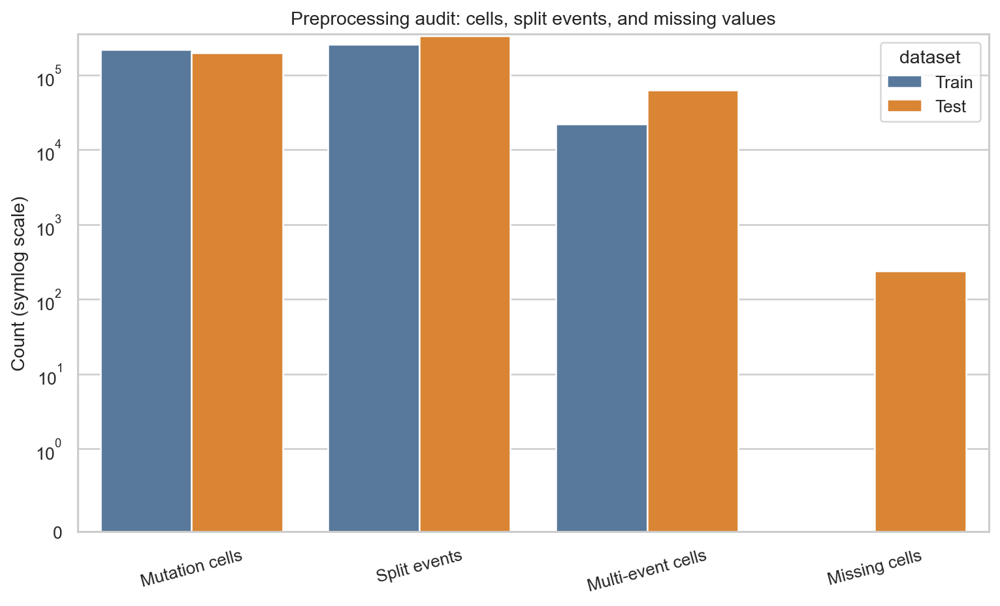
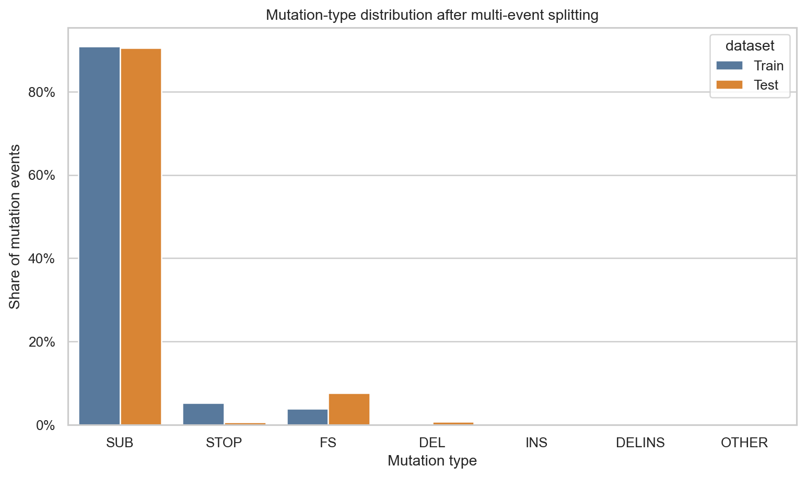
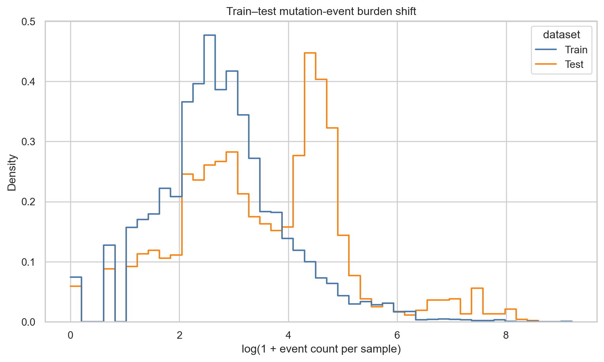
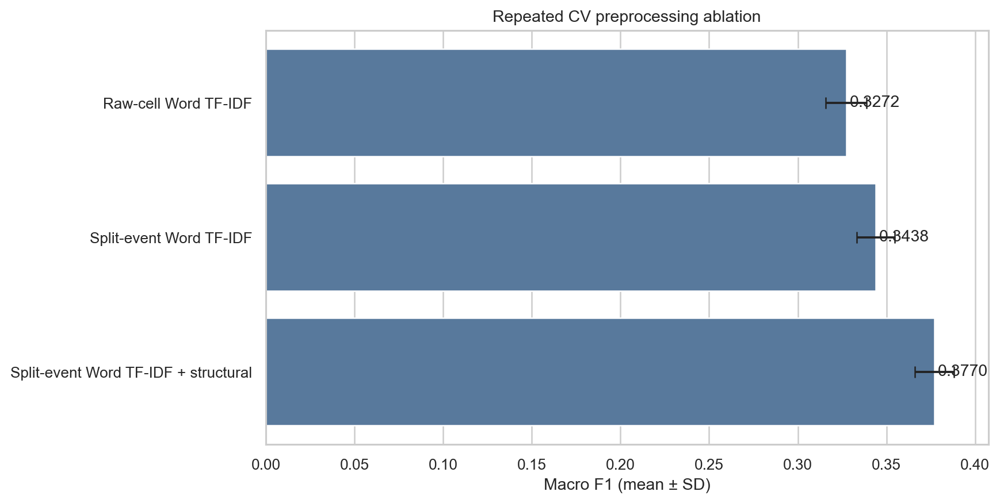
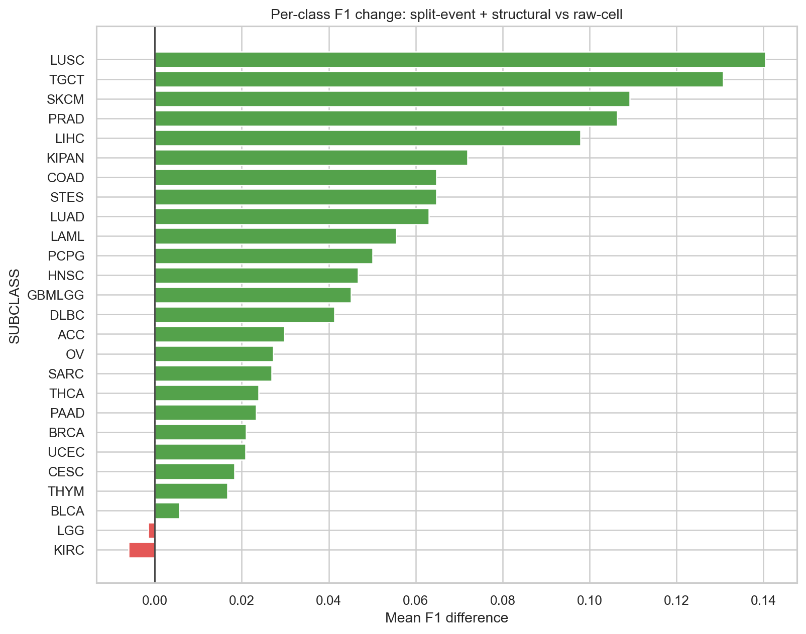

# 변이 문자열 전처리 실제 분석 결과

## 목적

한 유전자 셀에 공백으로 함께 기록된 여러 변이를 개별 event로 분리하는 전처리가
실제로 분류 성능에 도움이 되는지 확인했다. 원본 데이터만 사용했으며, 동일한
3-Fold 분할과 LinearSVC 조건에서 전처리 구성만 비교했다.

## 실행 조건

- 데이터: Train 6,201개, Test 2,546개, 유전자 4,384개
- 검증: Stratified 3-Fold, seed 42
- 문자열 피처: 해시 기반 Word TF-IDF 32,768차원
- 모델: LinearSVC, `C=0.4`, `class_weight=balanced`
- 구조 피처: 변이 유전자 수, event 수, multi-hit, 변이 유형 수·비율,
  위치 통계, 결측 통계 등 30개

해시 벡터화는 라벨이나 문서 빈도를 학습하지 않으며, IDF는 각 Fold의 학습부에서만
적합했다.

## 전처리 감사 결과

| 항목 | Train | Test |
| --- | ---: | ---: |
| 변이 셀 | 218,893 | 198,930 |
| 분리 후 event | 255,164 | 337,512 |
| 다중 event 셀 | 22,026 | 63,178 |
| 다중 event 셀 비율 | 10.1% | 31.8% |
| 샘플당 평균 event | 41.15 | 132.57 |
| 분리 전 `OTHER` 셀 | 17,947 | 57,160 |
| 분리 후 `OTHER` event | 0 | 2 |
| 결측 셀 | 0 | 237 |
| 위치 파싱 성공률 | 100% | 100% |

`L26V L24V`처럼 하나의 긴 값으로 취급되던 셀을 `L26V`, `L24V`로
분리하면서 변이 유형, 위치, event 수와 multi-hit 정보를 복원했다.





Train과 Test는 샘플당 event 수와 변이 유형 구성에서 차이가 크다. 이를 임의로
맞추기보다는 분포 이동 가능성으로 기록하고, 반복 CV와 강건한 피처로 대응해야 한다.



## 3-Fold ablation 결과

| 구성 | Macro F1 평균 | 표준편차 | Raw 대비 |
| --- | ---: | ---: | ---: |
| Raw-cell Word TF-IDF | 0.3272 | 0.0114 | 기준 |
| Split-event Word TF-IDF | 0.3438 | 0.0107 | **+0.0166** |
| Split-event Word TF-IDF + 구조 피처 | **0.3770** | 0.0110 | **+0.0498** |

다중 event 분리만으로 Macro F1이 0.0166 상승했다. 여기에 샘플별 변이 부담,
유형 비율, 위치와 multi-hit 같은 구조 피처를 결합했을 때 추가로 0.0332가
상승해 최종 평균 0.3770을 기록했다.



클래스별로는 LUSC, TGCT, SKCM, PRAD, LIHC의 개선이 컸고, LGG와 KIRC는
소폭 하락했다. 따라서 다음 단계에서는 전체 평균뿐 아니라 두 클래스의 Recall과
오분류 패턴을 별도로 확인해야 한다.



## 결론

1. 다중 event 분리는 정보 복원 효과와 CV 개선이 모두 확인돼 기본 전처리로 유지한다.
2. 구조 피처는 문자열 피처와 상호 보완적이므로 함께 사용하는 방향이 유효하다.
3. 이번 결과는 빠른 선별용 3-Fold 결과다. 최종 모델 반영 전에는 반복 CV로
   재확인하고 LGG·KIRC 하락 여부를 점검한다.
4. 기존 Word+Char TF-IDF·LinearSVC Public 0.3715 결과와 함께 보면, 문자열
   패턴과 구조 피처를 결합하는 방향을 다음 실험의 우선순위로 둘 수 있다.

## 재현 방법

원본 CSV를 `data/raw/`에 둔 뒤 실행한다.

```bash
python experiments/run_preprocessing_ablation.py \
  --config configs/preprocessing_ablation.yaml
```

생성되는 표와 원자료 감사 결과는 현재 폴더에, PNG 도표는
`docs/assets/preprocessing_ablation/`에 저장된다.

## 제한사항

- 3-Fold 1회 선별 결과이므로 최종 성능 추정치로 사용하지 않는다.
- 일부 LinearSVC 학습에서 수렴 경고가 발생했다. 최종 반복 실험에서는
  `max_iter`와 `tol`을 재조정해 확인한다.
- Test 라벨은 사용하지 않았으며, Test 분석은 분포와 전처리 품질 확인에만 사용했다.

